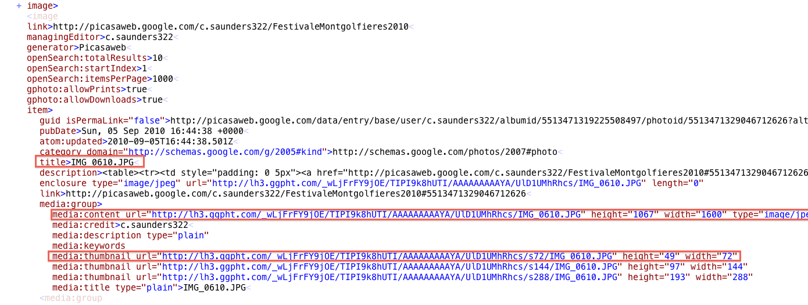

!SLIDE 
# Into SQLite #

!SLIDE bullets incremental transition=fade
# The Data #

## Picasa Feeds ##

* In particular mine (for now)

!SLIDE full-page center

!SLIDE full-page center

!SLIDE full-screen center

# Data Model #

!SLIDE center

# Picasa Objects #

[PicasaAlbum.java](./src/ca/christophersaunders/tutorials/sqlite/picasa/PicasaAlbum.java)

[PicasaImage.java](./src/ca/christophersaunders/tutorials/sqlite/picasa/PicasaImage.java)

!SLIDE bullets incremental

# Setting up the Database #

* onCreate( ) - Overridden by subclass, used to create the database
* onUpgrade( ) - Overridden by subclass, where migrations should occur

!SLIDE center

# Setting up the Database #

Database Helper - [ImageAlbumDatabaseHelper.java](./src/ca/christophersaunders/tutorials/sqlite/db/ImageAlbumDatabaseHelper.java)

!SLIDE bullets incremental center

# Pulling the Data #

SAX Parser - [PicasaHanlder.java](./src/ca/christophersaunders/tutorials/sqlite/picasa/PicasaHandler.java)

!SLIDE center

# Storing the Data #

[PicasaAlbumManager.java](./src/ca/christophersaunders/tutorials/sqlite/db/PicasaAlbumManager.java)

[PicasaImageManager.java](./src/ca/christophersaunders/tutorials/sqlite/db/PicasaImageManager.java)

[ImageAlbumRelationshipManager.java](./src/ca/christophersaunders/tutorials/sqlite/db/ImageAlbumRelationshipManager.java)

!SLIDE center

# Putting It All Together #

populateDataWithDefaults() - [SQLiteAndroidTutorialMainActivity.java](./src/ca/christophersaunders/tutorials/sqlite/SQLiteAndroidTutorialMainActivity.java)
